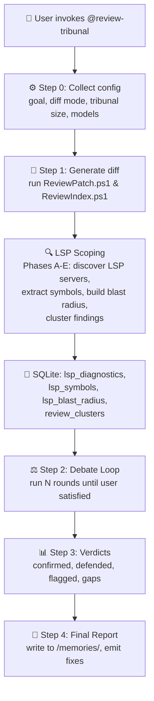
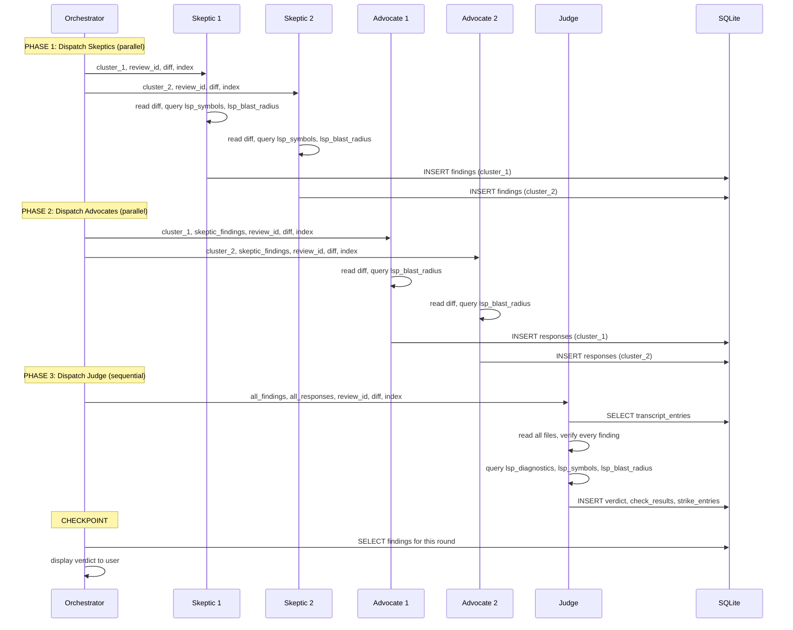
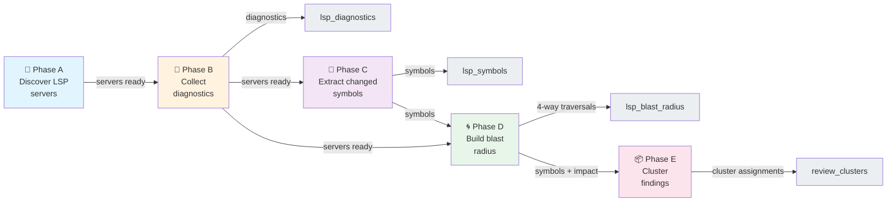
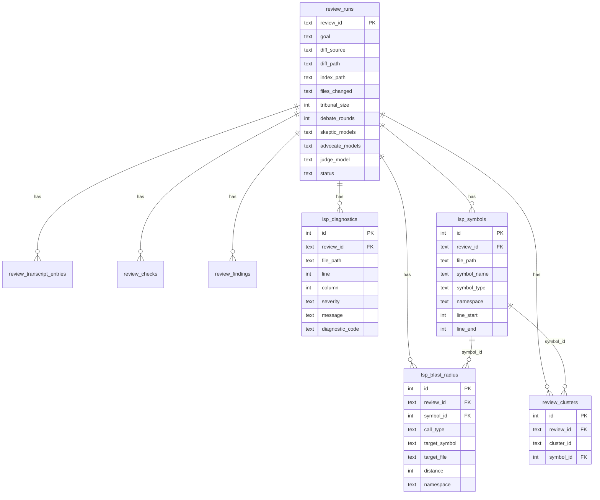
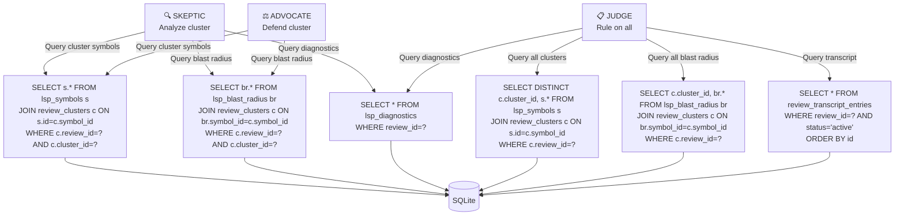
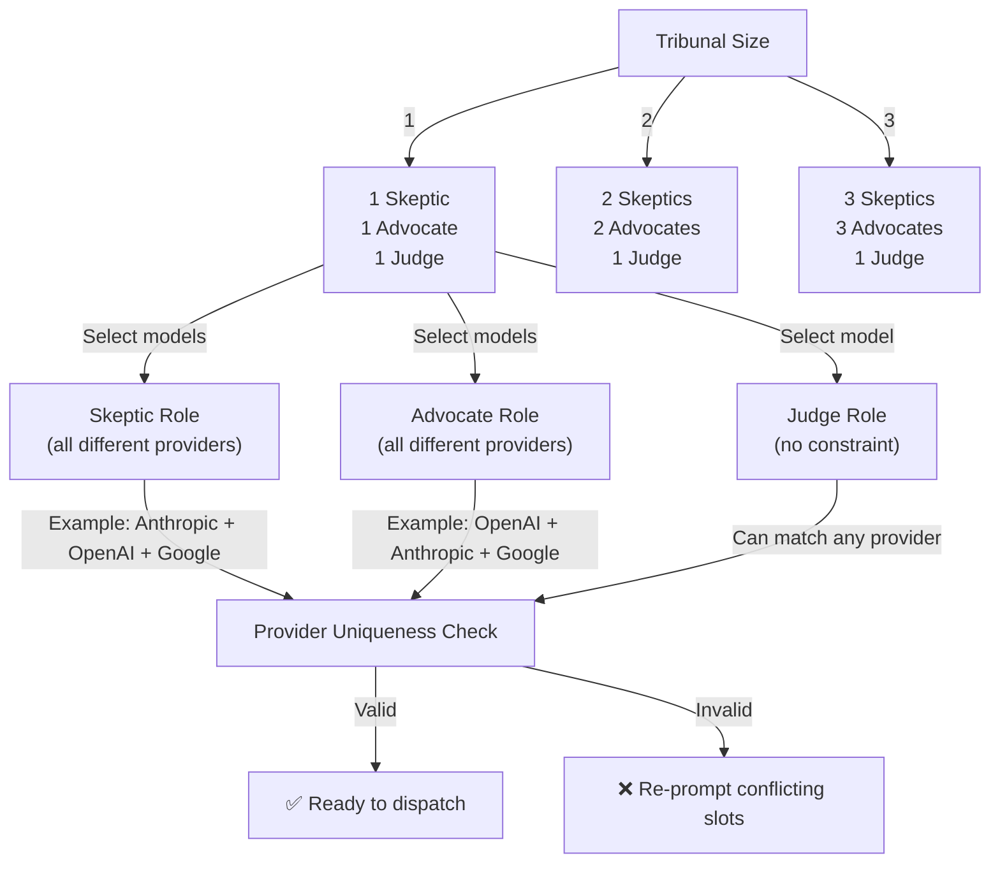

# review-tribunal

Adversarial code review plugin. Parallel Skeptics attack the implementation, parallel Advocates defend it, and a Judge rules on every finding by reading the code directly.

**Key features:**
- Configurable tribunal size (1–3 pairs) with full model diversity
- Debate rounds: Skeptics find defects → Advocates respond → Judge rules
- LSP-powered scoping for all diffs (identifies changed symbols and blast radius)
- SQLite session store for full audit trail and reproducibility
- Fix prompts and flags for human judgment

---

## What it does

- Accepts a branch comparison or staged diff (git diff --staged) as input
- Runs one or more debate rounds: Skeptics find defects, Advocates respond, Judge rules
- Uses LSP to scope review to changed symbols and their blast radius, clustering for efficiency
- Emits fix prompts for every confirmed issue; surfaces flags requiring human judgment
- Persists all findings in a SQLite session store; writes a final report to `/memories/`

---

## High-Level Flow



---

## Orchestrator Pseudo-Code

```
FUNCTION orchestrate_review(goal, diff_source, diff_targets, tribunal_size, debate_rounds, models)
    
    // Step 0: Collect configuration
    review_id = generate_slug(goal)
    verify_unique_providers_per_role(models)
    
    // Step 1: Generate diff
    patch_file, changed_files = run_ReviewPatch(diff_source, diff_targets)
    index_file = run_ReviewIndex(patch_file)
    
    // LSP Scoping (Phases A-E)
    lsp_servers = discover_lsp_servers(changed_files)
    start_all_lsp_servers(lsp_servers)
    
    diagnostics = collect_diagnostics(lsp_servers, changed_files)      // Phase B
    symbols = extract_symbols(lsp_servers, changed_files)             // Phase C
    blast_radius = build_blast_radius(lsp_servers, symbols)           // Phase D
    clusters = cluster_symbols(symbols, blast_radius, line_budget=6000) // Phase E
    
    // Store in SQLite
    INSERT lsp_diagnostics, lsp_symbols, lsp_blast_radius, review_clusters
    
    // Step 2: Debate Loop
    FOR round = 1 TO debate_rounds DO
        // Phase 1: Skeptics (parallel)
        FOR each cluster IN parallel UP TO tribunal_size DO
            findings[round] += skeptic(review_id, cluster, patch_file, index_file)
        END FOR
        
        // Phase 2: Advocates (parallel)
        FOR each skeptic_findings IN parallel UP TO tribunal_size DO
            responses[round] += advocate(review_id, skeptic_findings, patch_file, index_file)
        END FOR
        
        // Phase 3: Judge (sequential)
        verdict[round] = judge(review_id, findings[round], responses[round], patch_file)
        
        // Step 3: Checkpoint
        persist_findings(verdict[round])
        display_verdict(verdict[round])
        
        IF user selects "Stop" THEN
            BREAK
        END IF
    END FOR
    
    // Step 4: Final Report
    final_status = "confirmed" IF any(confirmed_findings) ELSE "clean"
    write_final_report(review_id, final_status, all_findings, all_verdicts)
    emit_fix_prompts(confirmed_findings)
    
END FUNCTION
```

---

## Debate Round Sequence



---

## LSP Scoping Workflow (Phases A–E)



### Phase A — Discover and start LSP servers

```pseudocode
FUNCTION phase_a_discover_lsp(files_changed)
    lsp_servers = {}
    unscoped_files = []
    
    FOR each file IN files_changed DO
        extension = file.extension()
        server = lsp_config.find_server(extension)
        
        IF server THEN
            IF server NOT IN lsp_servers THEN
                lsp_config.start_server(server)
                lsp_servers[server] = ready=false
            END IF
        ELSE
            unscoped_files.append(file)
        END IF
    END FOR
    
    // Wait for all servers ready
    FOR each server IN lsp_servers DO
        WAIT server.ready()
    END FOR
    
    RETURN (lsp_servers, unscoped_files)
END FUNCTION
```

### Phase B — Diagnostics pre-pass

```pseudocode
FUNCTION phase_b_diagnostics(lsp_servers, files_changed)
    diagnostics = []
    
    FOR each file IN files_changed DO
        server = lsp_servers[file.extension()]
        results = server.textDocument/diagnostic(file)
        
        FOR each diagnostic IN results DO
            diagnostics.append({
                file: file,
                line: diagnostic.line,
                column: diagnostic.column,
                severity: diagnostic.severity,
                message: diagnostic.message,
                code: diagnostic.code
            })
        END FOR
    END FOR
    
    // Pre-confirmed issues (errors = skip debate)
    INSERT INTO lsp_diagnostics (review_id, file_path, line, column, severity, message, diagnostic_code)
    
    RETURN diagnostics
END FUNCTION
```

### Phase C — Extract changed symbols (Pipelined)

```pseudocode
FUNCTION phase_c_extract_symbols(lsp_servers, files_changed, diff_hunks)
    symbol_pool = concurrent_pool(size=5..10)
    all_symbols = []
    
    FOR each file IN files_changed DO
        symbol_pool.add_task(() => {
            server = lsp_servers[file.extension()]
            symbols_in_file = server.textDocument/documentSymbol(file)
            
            FOR each symbol IN symbols_in_file DO
                // Keep only symbols overlapping with diff hunks
                IF symbol.line_range OVERLAPS diff_hunks[file] THEN
                    all_symbols.append({
                        file: file,
                        name: symbol.name,
                        type: symbol.type,
                        namespace: symbol.qualified_name,
                        line_start: symbol.start,
                        line_end: symbol.end
                    })
                END IF
            END FOR
        })
    END FOR
    
    symbol_pool.wait_all()
    
    // Deduplicate by (name, type, namespace)
    dedup_symbols = deduplicate_by_key(all_symbols, key=(name, type, namespace))
    
    // Insert unique symbols
    FOR each symbol IN dedup_symbols DO
        INSERT INTO lsp_symbols (review_id, file_path, symbol_name, symbol_type, namespace, line_start, line_end)
    END FOR
    
    RETURN dedup_symbols
END FUNCTION
```

### Phase D — Build blast radius (Pipelined)

```pseudocode
FUNCTION phase_d_blast_radius(lsp_servers, symbols)
    symbol_pool = concurrent_pool(size=10..20)
    
    FOR each symbol IN symbols DO
        symbol_pool.add_task(() => {
            server = lsp_servers[symbol.file.extension()]
            
            // Issue 4 LSP calls in parallel
            PARALLEL {
                incoming = server.textDocument/incomingCalls(symbol, 2_hops),
                outgoing = server.textDocument/outgoingCalls(symbol, 2_hops),
                supertypes = server.typeHierarchy/supertypes(symbol, 2_hops),
                subtypes = server.typeHierarchy/subtypes(symbol, 2_hops)
            }
            
            // Combine and deduplicate results
            all_results = incoming + outgoing + supertypes + subtypes
            dedup_results = deduplicate_by_key(all_results, 
                key=(call_type, target_symbol, target_file))
            
            // Filter exclusions
            filtered = filter_exclusions(dedup_results, 
                exclude_patterns=[*.generated.*, *.designer.*, *.g.cs, *_pb2.py],
                exclude_outside_repo_root=true)
            
            // Insert blast radius
            FOR each result IN filtered DO
                INSERT INTO lsp_blast_radius (
                    review_id, symbol_id, call_type, target_symbol, 
                    target_file, distance, namespace
                )
            END FOR
        })
    END FOR
    
    symbol_pool.wait_all()
END FUNCTION
```

### Phase E — Cluster findings

```pseudocode
FUNCTION phase_e_cluster(symbols, blast_radius, line_budget=6000)
    clusters = []
    cluster_id = 1
    current_cluster = []
    current_size = 0
    last_file = null
    
    FOR each symbol IN symbols SORTED BY file_path, line_start DO
        // Estimate size: symbol's code + blast radius reach
        symbol_size = estimate_lines(symbol)
        reach_files = blast_radius.get_target_files(symbol.id)
        reach_size = estimate_total_lines(reach_files)
        total_size = symbol_size + reach_size
        
        // Split at file boundary if adding symbol exceeds budget
        IF (current_size + total_size > line_budget) AND (symbol.file != last_file) THEN
            clusters.append({
                cluster_id: f"cluster_{cluster_id}",
                symbols: current_cluster
            })
            cluster_id += 1
            current_cluster = []
            current_size = 0
        END IF
        
        current_cluster.append(symbol.id)
        current_size += total_size
        last_file = symbol.file
    END FOR
    
    // Final cluster
    IF current_cluster.length() > 0 THEN
        clusters.append({
            cluster_id: f"cluster_{cluster_id}",
            symbols: current_cluster
        })
    END IF
    
    // Insert cluster assignments
    FOR each cluster IN clusters DO
        FOR each symbol_id IN cluster.symbols DO
            INSERT INTO review_clusters (review_id, cluster_id, symbol_id)
        END FOR
    END FOR
    
    RETURN clusters
END FUNCTION
```

---

## SQLite Schema & Data Flow



---

## Subagent Data Access Patterns



---

## Configuration & Model Assignment



---

## Files

```
review-tribunal/
├── PLUGIN.md                                    ← this file
├── agents/
│   ├── review-tribunal.agent.md                 ← orchestrator (user-invocable)
│   ├── review-tribunal-skeptic.agent.md         ← finds defects (dispatched)
│   ├── review-tribunal-advocate.agent.md        ← defends implementation (dispatched)
│   └── review-tribunal-judge.agent.md           ← rules on all findings (dispatched)
├── references/
│   ├── review-tribunal-schema.md               ← SQLite schema
│   ├── review-tribunal-invocation-examples.md  ← usage examples
│   ├── review-tribunal-subagent-behavior.md    ← common subagent workflow (Steps 1–3)
│   └── sql-bindings-reference.md              ← SQL binding patterns and examples
├── scripts/
│   ├── ReviewPatch.ps1                         ← generate unified diff
│   └── ReviewIndex.ps1                         ← generate file→line index
├── templates/
│   └── review-tribunal-final-report-template.md ← report format
└── prompts/
    └── (system prompts for agents)
```

## Installation

1. Copy this folder into your agent skills directory (e.g. `/mnt/skills/user/review-tribunal/`).
2. Place `scripts/ReviewPatch.ps1` and `scripts/ReviewIndex.ps1` somewhere on your
   PowerShell `$PATH`, or set the orchestrator's script path variable to their location.
3. Register the four agent files with your agent runtime.

## Invocation

User-facing entry point is `review-tribunal.agent.md`. The three subagent files are
internal — they are dispatched by the orchestrator and should not be invoked directly.

```
@review-tribunal branch:develop..feature/XYZ -- verify auth middleware handles token expiry
@review-tribunal uncommitted:feature/XYZ -- add error handling to Login
```

Arguments parsed from the invocation string:

| Argument | Format | Example |
|---|---|---|
| Branch comparison | `branch:base..head` | `branch:develop..feature/XYZ` |
| Staged diff | `uncommitted:branch` | `uncommitted:feature/XYZ` |
| Goal | free text after `--` | `verify auth middleware handles token expiry` |

Any arguments not supplied in the invocation string are collected interactively via
Step 0 of the orchestrator.

## Dependencies

| Dependency | Required for |
|---|---|
| `git` | Diff generation (all modes) |
| PowerShell 7+ | Running `ReviewPatch.ps1` and `ReviewIndex.ps1` |
| SQLite (via agent `sql` tool) | Session store — transcript, findings, checks |
| `lsp-config` + language servers | LSP scoping phase (all diffs) |

## Supported models

| Provider | Models |
|---|---|
| Anthropic | `claude-sonnet-4.6`, `claude-haiku-4.5` |
| OpenAI | `gpt-5.4`, `gpt-5.3-codex` |
| Google | `gemini-2.5`, `gemini-3-flash` |

No two slots within the same role (Skeptics, Advocates) may share a provider.
Slots across roles may share a provider. The Judge has no provider restriction.

## Tribunal sizes

| Size | Slots |
|---|---|
| 1 | 1 Skeptic, 1 Advocate, 1 Judge |
| 2 | 2 Skeptics, 2 Advocates, 1 Judge |
| 3 | 3 Skeptics, 3 Advocates, 1 Judge |

## Verdict Types

| Verdict | Meaning | Debate? |
|---------|---------|---------|
| **Confirmed** | Defect found; fix included | ✅ Debate closed |
| **Defended** | No defect; goal met | ✅ Debate closed |
| **Flagged** | Requires human judgment | ✅ Debate closed |
| **Gap** | Insufficient evidence | ✅ Debate closed |
| **Struck** | Finding factually wrong | ✅ Debate closed |
| **Diagnostic** | Compiler/linter error | ❌ Skips debate |

---

## Key Concepts

**LSP Scoping:** For all diffs, identifies changed symbols and their blast radius (callers, callees, type hierarchies) via Language Server Protocol. Clusters findings to keep each subagent's context manageable (6000-line budget).

**Tribunal Size:** Number of Skeptic-Advocate pairs. Larger tribunals provide more diverse perspectives but increase review time.

**Model Diversity:** No two slots within the same role (Skeptics or Advocates) may share a provider. Forces different reasoning strategies.

**Pipelined Parallelization:** LSP queries stream results as they complete; next query starts immediately when a pool slot opens. No batching delays.

**Single Source of Truth:** All data persists in SQLite. Subagents query the database for symbols, blast radius, diagnostics. No file-based intermediate state.

## Roundtrip Workflow

```
Round 1: Skeptics → Advocates → Judge → Verdict → Checkpoint

User: "Continue review"

Round 2: Skeptics → Advocates → Judge → Verdict → Checkpoint

User: "Stop — surface final verdict"

Final Report: Confirmed + Flagged + Gaps + Fix Prompts
```

Once a finding is Confirmed, Defended, Flagged, or Struck, it cannot be re-raised in subsequent rounds unless **the diff itself changed** between rounds.

## Troubleshooting

| Issue | Solution |
|-------|----------|
| LSP server fails to start | Check `lsp-config` installed; verify language server is on system |
| Provider uniqueness error | Select different providers for each Skeptic/Advocate slot |
| Subagent timeout | Increase context window; reduce tribunal size; smaller diff |
| SQLite lock error | Close other processes accessing session database |
